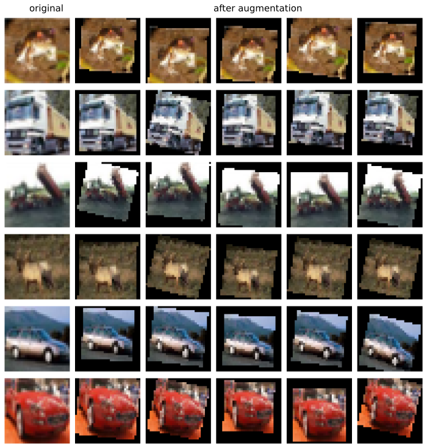

# Task 2

## Task 2-1

**Description**: Train LeNet5  as MNIST classifier

```bash
python3 -m Task2.1_train 
```

Test Accuracy: 0.991

**Analyzing**:

```bash
python3 -m Task2.1_analyze --ckpt-file <checkpoint-file-to-be-analyzed> --plot-mistakes <store-true> --confusion-matrix <store-true>
```

**Plot mistakes**


These examples show that some errors by LeNet are also indistinguishable even for human eyes.

## Task 2-2

**Description**: Train LeNet5 as Fashion-MNIST classifier

```bash
python3 -m Task2.2_train
```

Test Accuracy: 0.899

**Analyzing**

```bash
python3 -m Task2.2_analyze --ckpt-file <checkpoint-file-to-be-analyzed> --plot-mistakes <store-true> --confusion-matrix <store-true>
```

**Plot Mistakes**


It seems that LeNet is sensitive to some classes like Trouser, Coat while to other classes not.


## Show CIFAR10

```bash
python3 -m Task2.show_CIFAR10 --show --dataset-root <root-to-CIFAR10-dataset> --download <store-true> --imgs-dir <directory-to-store-images>
```


## Task 2-3

**Description**: Train 3-channel-LeNet5 as CIFAR10 classifier

### None: 0.663

learning rate: 0.1, epochs: 50, save model of highest validation accuracy

Test accuracy: 0.663

**Training**

```bash
python3 -m Task2.3
```

**Analyzing**

```bash
python3 -m Task2.3_analyze  --ckpt-file <path-to-checkpoint-file> --confusion-matrix --plot-mistakes
```

**Confusion Matrix**


### Learning rate scheduler: 0.676

initial learning rate = 0.1,  milestone1 = 10, milestone2 = 15, divide learning rate by 10 at every milestone 

```bash
python3 -m Task2.3 --training --LRScheduler --milestone1 10 --milestone2 15
```


### Image augmentation

**Show Augmentation**

```bash
python3 -m Task2.show_CIFAR10 --show-augment
```

**Auto Augmentation: 0.696**

```bash
T.AutoAugment(T.AutoAugmentPolicy.CIFAR10)

python3 -m Task2.3_train --ImageAugmentation --LRScheduler --milestone1 30 --milestone2 40 --epochs 60
```


**Color Jitter: 0.657**

```bash
T.ColorJitter(brightness=.5, hue=.3)

python3 -m Task2.3_train --ImageAugmentation --LRScheduler --milestone1 30 --milestone2 40
```


brightness [0.7, 1.3]  Test acc: 0.675

```bash
python3 -m Task2.3_train --ImageAugmentation --LRScheduler --milestone1 10 --milestone2 30 
```

contrast [0.7, 1.3]   Test acc: 0.652

```bash
python3 -m Task2.3_train --ImageAugmentation --LRScheduler --milestone1 15 --milestone2 25   
```


**Random Perspective: 0.697**

```bash
T.RandomPerspective(distortion_scale=0.4, p=0.4)

python3 -m Task2.3_train --ImageAugmentation --LRScheduler --milestone1 35 --milestone2 50
```


**Random Affine: 0.674**

```bash
T.RandomAffine(degrees=(0, 15), translate=(0, 0.1), scale=(0.75, 0.95))

python3 -m Task2.3_train --ImageAugmentation --LRScheduler --milestone1 40 --milestone2 60
```




| Augmentation  | None  | Auto Augmentation | Color Jitter | Random Perspective | Random Affine |
| ------------- | ----- | ----------------- | ------------ | ------------------ | ------------- |
| Test Accuracy | 0.676 | 0.696             | 0.657        | 0.697              | 0.674         |


## Task 2-4

**Description**. Train ResNet18 as CIFAR10 

AutoAugment, initial learning rate: 0.1, divided by 10 at epoch 100 and 150, 200 epochs 

Test accuracy: 0.906

```bash
python3 -m Task2.4_train --epochs 200 --ImageAugmentation --LRScheduler --milestone1 100 --milestone2 150
```

**Analyzing**

```bash
python3 -m Task2.4_analyze  --ckpt-file <path-to-checkpoint-file> --confusion-matrix --plot-mistakes
```

**Confusion Matrix**


## Task 2-5

batch_size 64 init_lr 0.01 epochs 10

* ResNet18 - freezing backbone

```bash
python3 -m Task2.5 --backbone-name "resnet" --freeze-backbone
```

* ResNet18 - no freezing backbone

```bash
python3 -m Task2.5 --backbone-name "resnet" 
```

* ResNet18 - no freezing image augmentation

```bash
python3 -m Task2.5 --backbone-name "resnet" 
```

* vgg16 freezing backbone

```bash
python3 -m Task2.5 --backbone-name "vgg" --freeze-backbone
```

- vgg16 - no freezing backbone

```bash
python3 -m Task2.5 --backbone-name "vgg" 
```

* vgg16_bn - no freezing backbone

```bash
python3 -m Task2.5 --backbone-name "vgg_bn" 
```

|              | Test Accuracy | Test Loss (CE) |
| ------------ | ------------- | -------------- |
| RseNet18 -f  | 0.48299       | 1.47549        |
| ResNet18     | 0.79134       | 0.84173        |
| ResNet18 -ia | 0.82407       | 0.52772        |
| VGG16 -f     | 0.63291       | 1.04766        |
| VGG16        | 0.87648       | 0.57948        |
| VGG16_ia     | 0.88499       | 0.37046        |

The training time could be reduced by half if the backbone is frozen.